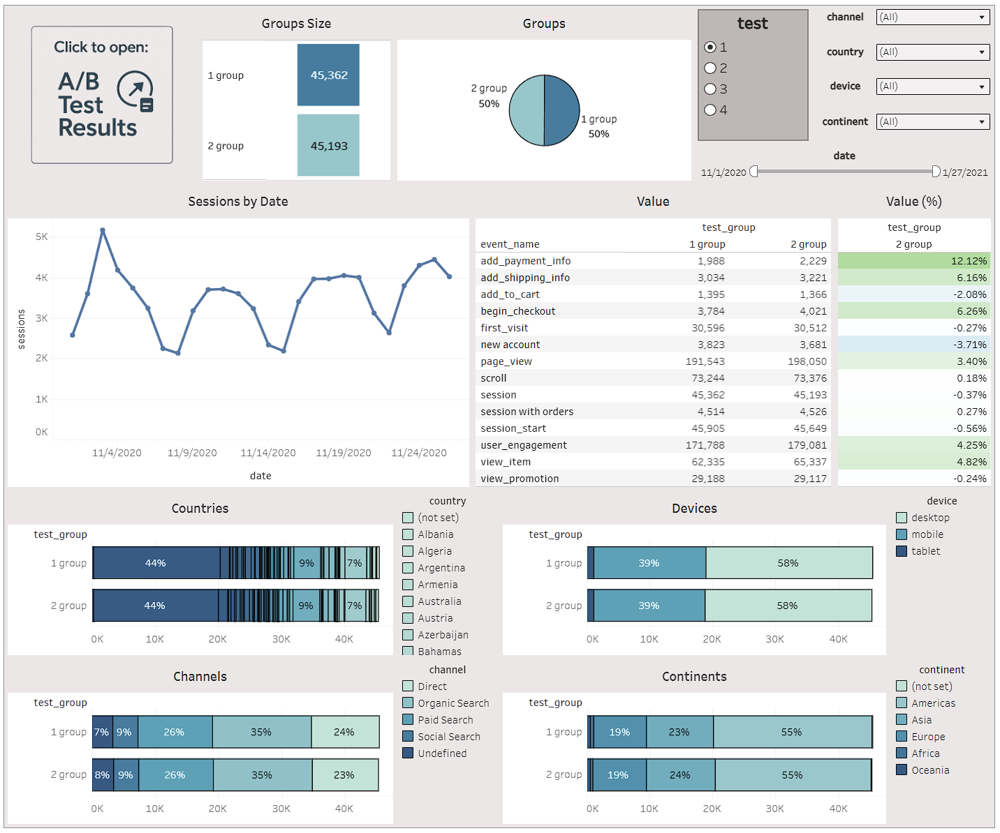
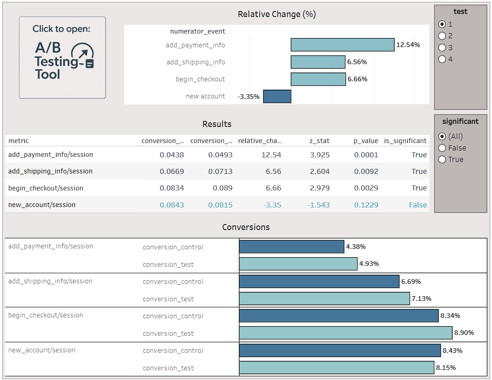

# A/B Testing Significance Calculator & Dashboard
**Portfolio project:** analyzing A/B test results and key conversion metrics using SQL, Python, and Tableau. The project includes data extraction from Google BigQuery, automated statistical significance calculation for multiple metrics (*add_payment_info, add_shipping_info, begin_checkout, new_accounts*) across different segments, and Tableau visualizations that show group distribution balance, metric results, and the statistical significance of differences between test and control groups.

---

## Project Objective
The goal of the project is to analyze A/B test results using **statistical methods in Python** and create visualizations that showcase **key conversion metrics**, helping clearly understand how product changes influence user behavior and overall performance.

---

## SQL Query Structure

**File:** `ab_test_data_preparation.sql`

The query is structured into **5 CTEs:**
1. **session_info** – created to collect all essential session data once and avoid repeating the same JOINs in every CTE.
2. **session_with_orders** — counts sessions that generated at least one order.
3. **events** — counts events by `event_name` for each combination of dimensions.
4. **session** — calculates the total number of sessions.
5. **account** — calculates the number of new accounts created.

Dimensions used for grouping and aggregation:
- **date** — session date.
- **country** — user’s country.
- **device** — device type (desktop, mobile, tablet).
- **continent** — continent of the user’s location.
- **channel** — overall traffic channel.
- **test** — ordinal number of the A/B test.
- **test_group** — group number within the A/B test (1 — A, 2 — B).

Final `UNION ALL` combines all metrics into one table with:  
date | country | device | continent | channel | test | test_group | event_name | value

---

## Tools & Technologies
To complete this project, the following tools and technologies were used:
- **SQL (Google BigQuery)** – creating an SQL query in BigQuery to combine multiple tables and build the dataset containing all necessary data;
- **Python** – used to connect to Google BigQuery and execute the created SQL query to load the dataset directly into the notebook. Also served for data processing, statistical calculations, and generation of the final dataset. The following libraries were used:
  - **Pandas** – aggregation
  - **StatsModels** – statistical significance testing with `z-test for proportions`
- **Google Colab** – environment for code execution;
- **Tableau Public** – dashboard creation for visualizing results.

---

## Notebook Structure

**File:** `ab_test_analysis.ipynb`

The Google Colab notebook is organized into the following main sections:
1. **Connecting and SQL Query** – mounting Google Drive and setting the working directory. This section also contains the SQL query used to retrieve the dataset from Google BigQuery.
2. **Statistical Significance Calculation** – the main part of the project, where a reusable calculator is built to compute A/B test results across different segments. This section also includes exporting the final aggregated dataset (total-level results) as a CSV file to Google Drive.  

   **File with results:** `ab_test_results.csv`

3. **Conclusions** – final results and recommendations.
4. **Tableau Visualization** – includes a link to the Tableau Public dashboard and its description.

---

## Dashboard Preview

**Visualization tool:** Tableau Public

*Tool dashboard preview:*  
  

*Results dashboard preview:* 
  

**[View interactive dashboard in Tableau Public](https://public.tableau.com/views/ABTestResultsDashboard/ABTestToolsDashboard?:language=en-US&:sid=&:redirect=auth&:display_count=n&:origin=viz_share_link)**

---

## Author

**Sviatoslav Mykytyn**  
📅 December 2025  
💼 Data Analytics Portfolio  
🔗 [LinkedIn](https://www.linkedin.com/in/sviatoslav-mykytyn-758997242/)
